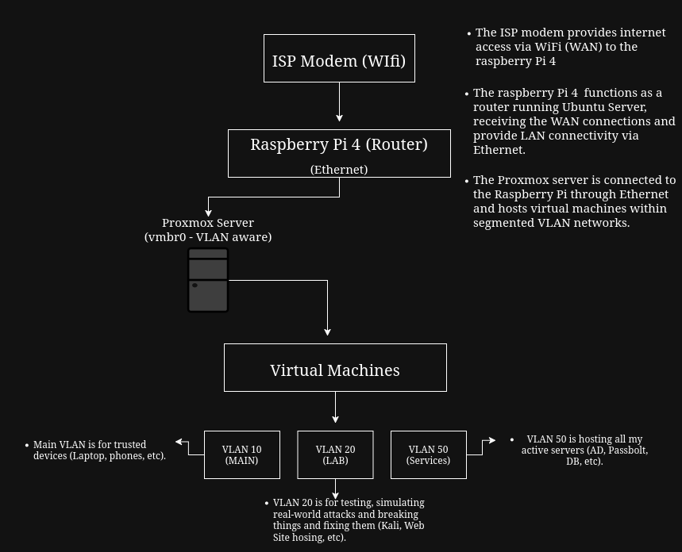
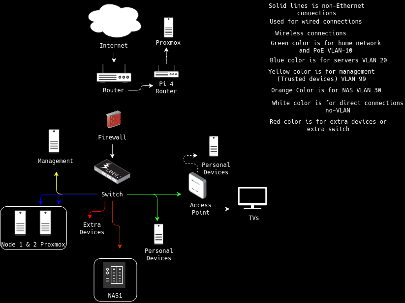

# Homelab-Infrastructure (Phase 1)

This repository documents my personal homelab in its current early-stage architecture (Phase 1).
The lab is designed to simulate real-world IT environments for learning and experimentation in networking, virtualization, and system administration.

The focus is on:

Networking fundamentals
Virtualization with VMs
Troubleshooting real systems
Linux system administration
Practical infrastructure design
🧭 Current Architecture

The current setup is designed for a minimal home environment with limited hardware and no managed switching infrastructure.

---

## Networking Evolution

### Current Network 

### Current Networking (Planned)

---

## Architecture

#### Current Architecture
The current network setup is designed to work within apartment limitations, where traditional wired infrastructure is not fully available.

- The ISP modems provides WAN connectivity via WiFi 
- The Raspberry Pi 4 functions as a router running Ubuntu server, bridging WiFi (WAN) to Ethernet (LAN).
- The Proxmox server connects via Ethernet and hosts virtual machines.
- A VLAN-aware bridge is used to segment network traffic across different environments.

#### Current Limitations
- No managed switch infrastructure
- No VLAN segmentation
- Limited to single LAN environment
- WiFi-based uplink from ISP router
- No persistent 24/7 hardware operation

---

## Troubleshooting 

### Issue: VM had no internet access
- Checked interface configuration (`ip a`)
- Verified routing table (`ip route`)
- Tested connectivity

Resolved incorrect gateway configuration.

---

## Lessons Learned

- Proper routing and gateway configuration is critical. 
- VLAN segmentation improves organization and security.
- Structured troubleshooting reduces time spent debugging.

--- 

## Future Plans (Phase 2)

This is planned evolution, not current state:

--- 

### Network Expansion 
- Implement a manged switch for improve VLAN control
- Expand network segmentation and traffic management
- Access point, will allow me to have two ssids
  - SSID-1: Personal trusted devices
  - SSID-2: Non trusted devices(TV will need to reach NAS)

---

### Infrastructure Upgrade 
- Move to rack-based setup (8u 10" rack)
- Fully wired internal network
- Reduce reliance on WiFi uplink

---

### Sandbox Expansion
- Transfers my current setup into a sandbox isolated lab environments
- More VM experimentation environments

---

### NAS / Storage 
- Build a low-power NAS using/new hardware
- Host storage services on Proxmox using Ubuntu Server
- Configure manual storage and backup solutions 

---

## Summary 
This Phase 1 homelab is a minimal but functional dual-system setup consisting of:

- A virtualization host (Proxmox Pc)
- An isolated sandbox router (Raspberry Pi 4)

It is design to gradually evolve into a full  enterprise-style lab with VLANS, switching, and rack-mounted infrastructure.
